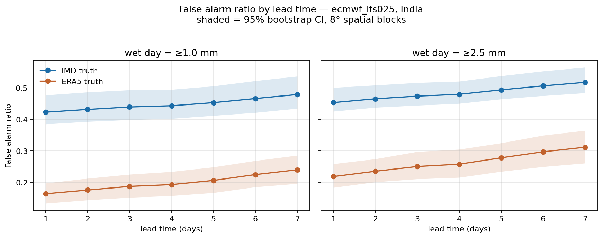
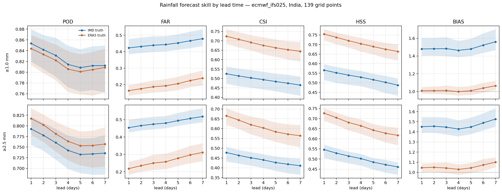

# Results — rainfall forecast skill over India

Model: `ecmwf_ifs025` (pinned). Truth: IMD 0.25° gridded, 0300–0300 UTC rainfall day.
Uncertainty: 95% bootstrap CI, resampling 8° spatial blocks (not individual points — rainfall is spatially correlated, and point-level resampling halves the interval width).

**The headline is the frequency bias.** The model calls rain on 34.9% of days; rain falls on 23.6%. BIAS = 1.48, near-flat across leads. Two consequences follow, each measured independently: the two directions come apart (PPV 0.577 against NPV 0.947 at lead 1), and the rain direction loses to persistence at lead 1 (0.577 against 0.623, paired 95% CI on the difference -0.074 to -0.016). See `persistence_benchmark.csv`.

## Wet day = ≥1.0 mm — IMD truth (primary)

| Lead | POD | **FAR** | CSI | HSS | BIAS | hits | false alarms | misses | n |
|---|---|---|---|---|---|---|---|---|---|
| 1 | 0.853 | **0.423** (0.385–0.477) | 0.525 | 0.566 | 1.48 | 25,917 | 19,009 | 4,449 | 128,714 |
| 2 | 0.842 | **0.432** (0.393–0.487) | 0.513 | 0.552 | 1.48 | 25,562 | 19,422 | 4,804 | 128,714 |
| 3 | 0.831 | **0.440** (0.399–0.494) | 0.503 | 0.540 | 1.48 | 25,240 | 19,795 | 5,126 | 128,714 |
| 4 | 0.814 | **0.444** (0.403–0.495) | 0.494 | 0.529 | 1.46 | 24,732 | 19,714 | 5,634 | 128,714 |
| 5 | 0.809 | **0.453** (0.412–0.506) | 0.484 | 0.516 | 1.48 | 24,552 | 20,367 | 5,814 | 128,714 |
| 6 | 0.812 | **0.466** (0.422–0.523) | 0.475 | 0.502 | 1.52 | 24,661 | 21,559 | 5,705 | 128,714 |
| 7 | 0.812 | **0.479** (0.435–0.537) | 0.465 | 0.487 | 1.56 | 24,669 | 22,704 | 5,697 | 128,714 |

## Wet day = ≥2.5 mm — IMD truth (primary)

| Lead | POD | **FAR** | CSI | HSS | BIAS | hits | false alarms | misses | n |
|---|---|---|---|---|---|---|---|---|---|
| 1 | 0.793 | **0.454** (0.426–0.501) | 0.478 | 0.547 | 1.45 | 19,072 | 15,835 | 4,987 | 128,714 |
| 2 | 0.778 | **0.466** (0.438–0.509) | 0.464 | 0.529 | 1.46 | 18,713 | 16,305 | 5,346 | 128,714 |
| 3 | 0.761 | **0.474** (0.445–0.517) | 0.451 | 0.515 | 1.45 | 18,299 | 16,496 | 5,760 | 128,714 |
| 4 | 0.742 | **0.480** (0.451–0.521) | 0.441 | 0.502 | 1.43 | 17,861 | 16,484 | 6,198 | 128,714 |
| 5 | 0.733 | **0.494** (0.465–0.538) | 0.427 | 0.485 | 1.45 | 17,624 | 17,205 | 6,435 | 128,714 |
| 6 | 0.734 | **0.507** (0.475–0.553) | 0.419 | 0.472 | 1.49 | 17,660 | 18,139 | 6,399 | 128,714 |
| 7 | 0.736 | **0.518** (0.484–0.566) | 0.411 | 0.461 | 1.53 | 17,703 | 19,017 | 6,356 | 128,714 |

## Wet day = ≥1.0 mm — ERA5 truth (robustness check)

| Lead | POD | **FAR** | CSI | HSS | BIAS | hits | false alarms | misses | n |
|---|---|---|---|---|---|---|---|---|---|
| 1 | 0.844 | **0.164** (0.133–0.197) | 0.724 | 0.755 | 1.01 | 37,574 | 7,352 | 6,951 | 128,714 |
| 2 | 0.833 | **0.175** (0.144–0.212) | 0.708 | 0.738 | 1.01 | 37,094 | 7,890 | 7,431 | 128,714 |
| 3 | 0.822 | **0.187** (0.152–0.225) | 0.691 | 0.720 | 1.01 | 36,606 | 8,429 | 7,919 | 128,714 |
| 4 | 0.806 | **0.193** (0.157–0.234) | 0.676 | 0.704 | 1.00 | 35,875 | 8,571 | 8,650 | 128,714 |
| 5 | 0.801 | **0.206** (0.167–0.249) | 0.663 | 0.690 | 1.01 | 35,664 | 9,255 | 8,861 | 128,714 |
| 6 | 0.805 | **0.225** (0.185–0.269) | 0.653 | 0.675 | 1.04 | 35,833 | 10,387 | 8,692 | 128,714 |
| 7 | 0.809 | **0.240** (0.196–0.286) | 0.644 | 0.664 | 1.06 | 36,010 | 11,363 | 8,515 | 128,714 |

## Wet day = ≥2.5 mm — ERA5 truth (robustness check)

| Lead | POD | **FAR** | CSI | HSS | BIAS | hits | false alarms | misses | n |
|---|---|---|---|---|---|---|---|---|---|
| 1 | 0.817 | **0.218** (0.183–0.259) | 0.665 | 0.727 | 1.05 | 27,282 | 7,625 | 6,097 | 128,714 |
| 2 | 0.802 | **0.235** (0.201–0.274) | 0.643 | 0.705 | 1.05 | 26,780 | 8,238 | 6,599 | 128,714 |
| 3 | 0.781 | **0.250** (0.211–0.297) | 0.620 | 0.681 | 1.04 | 26,081 | 8,714 | 7,298 | 128,714 |
| 4 | 0.764 | **0.258** (0.216–0.305) | 0.604 | 0.665 | 1.03 | 25,491 | 8,854 | 7,888 | 128,714 |
| 5 | 0.753 | **0.278** (0.234–0.325) | 0.584 | 0.643 | 1.04 | 25,144 | 9,685 | 8,235 | 128,714 |
| 6 | 0.754 | **0.297** (0.250–0.349) | 0.572 | 0.628 | 1.07 | 25,164 | 10,635 | 8,215 | 128,714 |
| 7 | 0.757 | **0.312** (0.261–0.365) | 0.564 | 0.617 | 1.10 | 25,274 | 11,446 | 8,105 | 128,714 |

## Truth-source gap in FAR

ERA5's wet bias is one-directional: it converts real false alarms into apparent hits. A negative gap means ERA5 **understates** FAR, flattering the forecast.

**Mechanism, measured.** The gap was tested against two non-IFS models (DWD ICON, NCEP GFS) on a matched 47-point sample — see `crossmodel_far_gap.csv`. Their gaps are smaller in magnitude than ECMWF's, significantly so, but only by **7–16%**. So scoring an ECMWF forecast against ECMWF's own reanalysis does inflate the gap (shared IFS lineage is real), yet it accounts for roughly one eighth of it. The remaining ~85% is ERA5's wet bias, which flatters every model about equally. Reanalysis truth is the wrong choice here regardless of whose forecast is being scored.

| threshold_mm | lead_days | ERA5 | IMD | FAR_gap_ERA5_minus_IMD |
|---|---|---|---|---|
| 1.000 | 1.000 | 0.164 | 0.423 | -0.259 |
| 1.000 | 2.000 | 0.175 | 0.432 | -0.256 |
| 1.000 | 3.000 | 0.187 | 0.440 | -0.252 |
| 1.000 | 4.000 | 0.193 | 0.444 | -0.251 |
| 1.000 | 5.000 | 0.206 | 0.453 | -0.247 |
| 1.000 | 6.000 | 0.225 | 0.466 | -0.242 |
| 1.000 | 7.000 | 0.240 | 0.479 | -0.239 |
| 2.500 | 1.000 | 0.218 | 0.454 | -0.235 |
| 2.500 | 2.000 | 0.235 | 0.466 | -0.230 |
| 2.500 | 3.000 | 0.250 | 0.474 | -0.224 |
| 2.500 | 4.000 | 0.258 | 0.480 | -0.222 |
| 2.500 | 5.000 | 0.278 | 0.494 | -0.216 |
| 2.500 | 6.000 | 0.297 | 0.507 | -0.210 |
| 2.500 | 7.000 | 0.312 | 0.518 | -0.206 |

